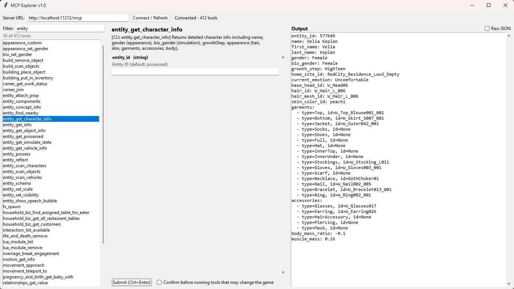

# MCP Explorer

A small desktop tool for browsing and calling the tools exposed by an app's built-in MCP server, with no AI assistant required.  Built specifically for use with inZOI, but it should universally work with anything.

It lists every tool the server offers, builds an input form for the one you select, runs it, and shows the result in a readable format.

> **Unofficial.** This project is not affiliated with or endorsed by Krafton or inZOI. It talks to the game's local MCP server using the standard MCP protocol (JSON-RPC over HTTP).



## What it does

- **Lists every tool** from the server's `tools/list`, with a live filter that searches names and descriptions.
- **Builds an input form** for the selected tool from its schema. Required fields are marked `*`; enums and booleans are dropdowns; arrays and objects take JSON.
- **Runs the tool** and shows the result as indented, readable text instead of one long JSON string. A **Raw JSON** toggle shows the full response.
- **Asks before changing anything.** Tools whose names don't look read-only (set, add, remove, create, and anything unrecognized) trigger a confirmation showing the arguments first. This can be turned off.
- **Adapts to game updates.** Tools and parameters are read from the server each time you connect, so nothing is hard-coded.

## Requirements

- inZOI, running, with its MCP server available (default `http://localhost:11212/mcp` - for more information, see `https://mod-docs.playinzoi.com/`).
- **Either** Python 3.9+ (to run from source) **or** the prebuilt Windows `.exe` (no Python needed).

The MCP server only exists while the game is running.

## Run the prebuilt exe (Windows)

1. Download `mcp_explorer.exe` from the [Releases](../../releases) page.
2. Start inZOI and load into a save.
3. Double-click `mcp_explorer.exe`. It connects automatically.

Windows SmartScreen may warn about an unknown publisher, because the file isn't code-signed. Some antivirus tools also flag unsigned PyInstaller executables. If you'd rather not run an unsigned exe, build it yourself from the source (below) or run the script directly.

## Run from source

### Windows

1. Install Python from [python.org](https://www.python.org/downloads/). Tick **Add python.exe to PATH** in the installer. tkinter is included.
2. Open PowerShell or Command Prompt in the project folder and install the one dependency:

   ```
   pip install requests
   ```

3. Start the game, then run:

   ```
   python mcp_explorer.py
   ```

### macOS

1. Install Python 3 from [python.org](https://www.python.org/downloads/) (includes tkinter). If you use Homebrew instead, also run `brew install python-tk`.
2. Install the dependency:

   ```
   pip3 install requests
   ```

3. Start the game, then run:

   ```
   python3 mcp_explorer.py
   ```

## Using it

1. Start inZOI and load a save.
2. Launch MCP Explorer. The status line shows `Connected - N tools`. If it fails, check the URL and click **Connect / Refresh**.
3. Type in the **Filter** box to narrow the list, then click a tool.
4. Fill in the inputs. Leave optional fields blank to omit them.
5. Click **Submit** (or press **Ctrl+Enter**). Results appear on the right.
6. Tick **Raw JSON** to see the complete response.

Many tools act on the **possessed** (selected) character or an **entity ID**. Run tools such as `entity_get_possessed`, `household_list`, or `world_list_characters` first to find IDs to use elsewhere.

## Safety

Some tools change your game or save: editing stats and money, moving or removing household members, destroying Zois, changing the world. **Back up your save folder before experimenting.** The confirmation prompt is a heuristic based on tool names, so it can misjudge an oddly named tool in either direction.

## Troubleshooting

| Problem | What to try |
|---|---|
| "Could not connect" | Make sure the game is running and a save is loaded. Check the URL and port in the Server URL box. |
| Works, then every call fails | The game was probably restarted. Click **Connect / Refresh** to start a new session. |
| Port conflict | The game accepts a launch option (`-climcpport=<port>`) to change the MCP port; use the matching URL here. |
| Running from WSL2 | `localhost` inside WSL may not reach the game on Windows. Run the tool with Windows Python instead. |
| Windows warns about the exe | It's unsigned. Run from source or build it yourself if you prefer. |

## Limitations

- Only works while the game is running.
- Output formatting is generic. Unusual responses may look better under **Raw JSON**.
- No saved history, no scripting or automation, and no authentication support.
- Does not save any settings (i.e. window position/size, custom MCP server or port, cautionary confirmation checkbox state).

## Disclaimer

This tool can modify your game. Use it at your own risk and keep backups. Check the game's current terms and modding guidelines before sharing or using this tool in any way they cover.

## License

GPL-3.0-or-later. See the [LICENSE](LICENSE) file.
